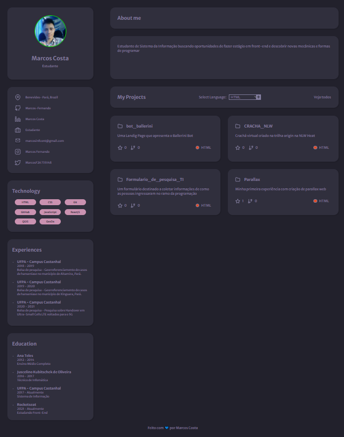

# Sobre o projeto

Portfólio é uma aplicação criada para apresentar minha trajetória até o momento. Desde dados pessoais, até meus projetos hospedados no GitHub.

A aplicação foi baseado no desafio de portfólio proposto pela Rocketseat. Porém, foi realizada algumas alterações para apresentar meu diferencial.

# Layout
Foram utilizados os display Grid e Flex para propocionar responsividade no site.



# Tecnologias utilizadas
 - HTML
 - CSS
 - JavaScript
 - API do GitHub

# Uso
Caso queira utilizar este projeto, poderá está fazendo alterações direto no arquivo main.js

``` JavaScript
    const userSocialLinks = {
        github: "Marcos-Fernando",
    }
```
 * Aqui poderá está mudando meu nome pelo nome de usuário do seu GitHub, logo, vários comandos irão se modificar, como foto do perfil, nome, compania, projetos do git, entre outros...
 * O projeto busca informações direto do GitHub proporcionando a adição de bastante dados.

 ``` JavaScript
    var color = item.language == "HTML" ? '#e34c26' 
                : item.language == "CSS" ? '#563d7c' 
                : item.language == "TypeScript" ? '#2b7489'
                : '#f1e05a'
```

* Neste ponto você poderá modificar as linguagens adicionadas aqui e na tag select encontrada no index.html. Essas foram escolhidas, pois são as que mais estou estudando.

# Autor
Marcos Fernando Soares Costa

## Email
marcosinfcont@gmail.com